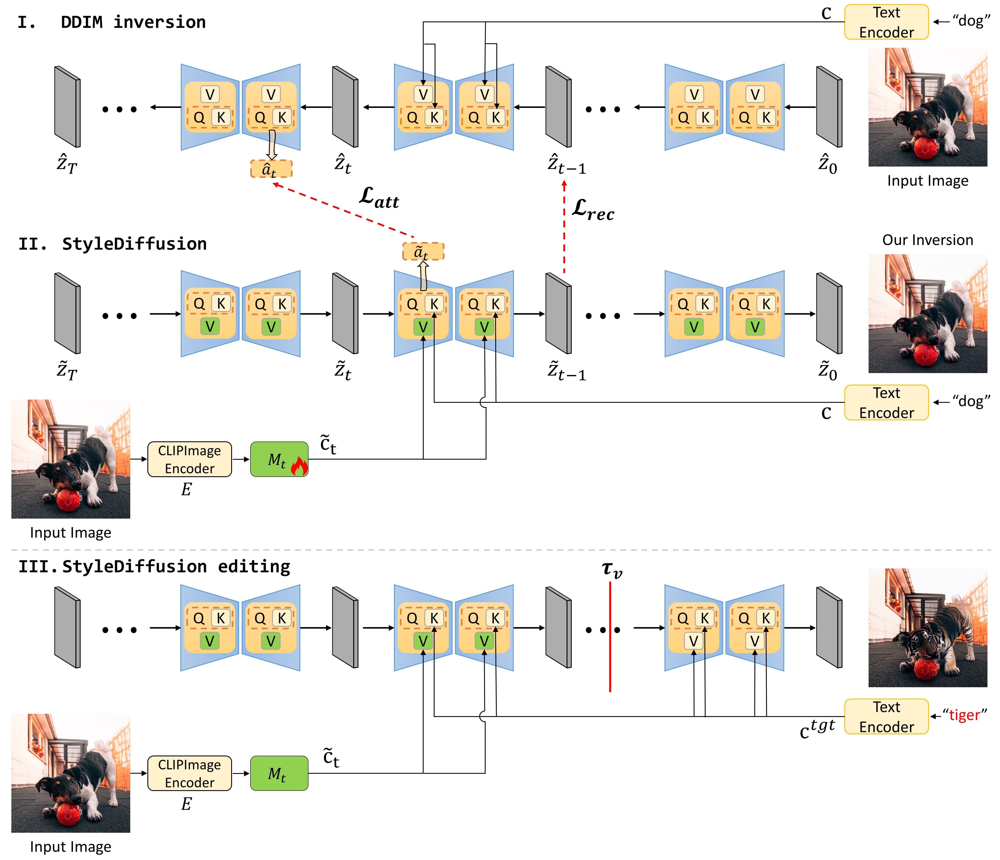

# StyleDiffusion: Prompt-Embedding Inversion for Text-Based Editing (Jittor)</sub>

**StyleDiffusion: Prompt-Embedding Inversion for Text-Based Editing - Jittor Version<br>

Abstract: *A significant research effort is focused on exploiting the amazing capacities of pretrained diffusion models for the editing of images. They either finetune the model, or invert the image in the latent space of the pretrained model. However, they suffer from two problems: (1) Unsatisfying results for selected regions, and unexpected changes in nonselected regions. (2) They require careful text prompt editing where the prompt should include all visual objects in the input image. To address this, we propose two improvements: (1) Only optimizing the input of the value linear network in the cross-attention layers, is sufficiently powerful to reconstruct a real image. (2) We propose attention regularization to preserve the object-like attention maps after editing, enabling us to obtain accurate style editing without invoking significant structural changes. We further improve the editing technique which is used for the unconditional branch of classifier-free guidance, as well as the conditional one as used by P2P. Extensive experimental prompt-editing results on a variety of images, demonstrate qualitatively and quantitatively that our method has superior editing capabilities than existing and concurrent works.*

[[`arXiv`](https://arxiv.org/abs/2303.15649)] [[`pdf`](https://arxiv.org/pdf/2303.15649.pdf)] [[`Jittor`](https://github.com/Jittor/jittor)]

This folder contains the Jittor implementation scripts. All result figures referenced below are generated by the Jittor code in this folder.

## 🛠️ Method Overview
<span id="method-overview"></span>



Overview of the proposed method. ($\textbf{I}$) DDIM inversion: the diffusion process is performed to generate the latent representations: ${(\mathbf{\hat{z}}\_t, \mathbf{\hat{a}}\_t)} (t = 1,...,T)$, where $\mathbf{\hat{z}}\_0 = \mathbf{z}\_0$, which is the extracted feature of the input real image $\mathbf{x}$. $\mathbf{c}$ is the extracted textual embedding by a Clip-text Encoder with a given prompt $\mathbf{p}^{src}$.    ($\textbf{II}$) Stylediffusion: we take the input image $\mathbf{x}$ as input, and extract the prompt-embedding $\mathbf{\widetilde{c}}\_{t} = M\_{t}\left ( E(\mathbf{\mathbf{x}})\right )$, which is taken as the input value matrix $\mathbf{v}$ of the linear layer $\Psi\_V$. The input of the linear layer $\Psi\_K$ is the given textual embedding $\mathbf{c}$.  We get both the latent code $\mathbf{\widetilde{z}\_{t-1}}$ and the attention map $\mathbf{\widetilde{a}}\_t$, which are aligned with both the latent code $\mathbf{\hat{z}\_{t-1}}$ and the attention map $\mathbf{\hat{a}\_{t}}$, respectively.  Note  $\mathbf{\widetilde{z}}\_T = \mathbf{\hat{z}}\_T$.     ($\textbf{III}$) StyleDiffusion editing: from T to $\tau\_v$ timestep, the input of the linear network $\Psi\_v$ comes from the learned textual embedding $\mathbf{\widetilde {c}\_{t}}$ produced by the trained $M_t$. From $\tau\_{v}-1$ to 1 the corresponding input comes from the prompt-embedding $\mathbf{c}^{tgt}$ of the target prompt. We use P2Plus to perform the attention exchange.

## 💻 Requirements
<span id="requirements"></span>

The Jittor codebase is tested in this workspace with:

* Python 3.9
* Jittor 1.3.11
* CUDA-enabled Jittor runtime
* A JDiffusion-compatible Stable Diffusion backend for SD 1.5

Create and configure a Jittor environment:

```bash
conda create -n stylediffusion-jittor python=3.9 -y
conda activate stylediffusion-jittor
pip install -r Jittor/requirements_jittor.txt

export PYTHONPATH="$PWD:$PWD/third_party:$PYTHONPATH"
```

Verify Jittor:

```bash
python - <<'PY'
import jittor as jt
import JDiffusion
from Jittor import jdiffusion_backend

jt.flags.use_cuda = 1
print('jittor', jt.__version__, 'cuda', jt.flags.use_cuda)
print('JDiffusion', JDiffusion.__file__)
print('SD 1.5 model id', jdiffusion_backend.resolve_model_id('sd_1_5'))
PY
```

The provided `jdiffusion_backend.py` expects a JDiffusion-compatible package exposing `JDiffusion.StableDiffusionPipeline`. If JDiffusion is checked out separately, add it to `PYTHONPATH`, for example:

```bash
export PYTHONPATH=/path/to/JDiffusion/python:$PYTHONPATH
```

The Stable Diffusion 1.5 and CLIP weights should be available in the local Hugging Face cache when using `--local_files_only True`. To allow downloading missing weights, pass `--local_files_only False`.

Environment or python libraries:

```bash
pip install -r Jittor/requirements_jittor.txt
```

Important Jittor files:

* `Jittor/stylediffusion.py`: main Jittor training/editing implementation.
* `Jittor/stylediffusion_csv.py`: CSV batch runner for Jittor.
* `Jittor/jdiffusion_backend.py`: backend loader for a JDiffusion Stable Diffusion pipeline.
* `Jittor/export_torch_mapping.py`: converts original PyTorch mapping checkpoints to Jittor-loadable `.pkl` files.

## ⏳ Training ⌛
<span id="training"></span>

**1. Training mapping-network of StyleDiffusion with a detailed description text in Jittor.**

```bash
python Jittor/stylediffusion.py \
  --backend_module jdiffusion_backend \
  --local_files_only True \
  --sd_version sd_1_5 \
  --is_train True \
  --index 1 \
  --prompt "black and white dog playing red ball on black carpet" \
  --image_path "./example_images/black and white dog playing red ball on black carpet.jpg"
```

or

```bash
python Jittor/stylediffusion_csv.py \
  --backend_module jdiffusion_backend \
  --local_files_only True \
  --sd_version sd_1_5 \
  --is_train True \
  --prompts_path ./data/stylediffusion_prompts.csv \
  --from_case 1 \
  --end_case 2
```

Trained mapping-network from the original project: [model_learnv](https://drive.google.com/drive/folders/11mGPGNhHqH_1TqqSjW9qUFVDL9Ks0Cla?usp=sharing)

To reproduce the provided Jittor editing results from original PyTorch mapping checkpoints, export the mapping network first:

```bash
python Jittor/export_torch_mapping.py \
  --input 'model_learnv/model-inner100-epoch1-learnv-[1].pth' \
  --output 'Jittor/checkpoints/model-inner100-epoch1-learnv-[1].pkl'
```

The current reproduced checkpoints are stored at:

```text
Jittor/checkpoints/model-inner100-epoch1-learnv-[0].pkl
Jittor/checkpoints/model-inner100-epoch1-learnv-[1].pkl
Jittor/checkpoints/model-inner100-epoch1-learnv-[2].pkl
```

**2. Training mapping-network of StyleDiffusion with 1 word in Jittor.**

```bash
python Jittor/stylediffusion.py \
  --backend_module jdiffusion_backend \
  --local_files_only True \
  --sd_version sd_1_5 \
  --is_train True \
  --is_1word 1 \
  --index 1 \
  --prompt "dog" \
  --image_path "./example_images/black and white dog playing red ball on black carpet.jpg"
```

or

```bash
python Jittor/stylediffusion_csv.py \
  --backend_module jdiffusion_backend \
  --local_files_only True \
  --sd_version sd_1_5 \
  --is_train True \
  --is_1word 1 \
  --prompts_path ./data/stylediffusion_prompts_1word.csv \
  --from_case 1 \
  --end_case 2
```

Trained mapping-network from the original project: [model_learnv_1word](https://drive.google.com/drive/folders/1EYjd02UZQwjAO6hl2dKmpEMteoFlN7jC?usp=sharing)

Export 1-word PyTorch checkpoints in the same way before using them for Jittor inference.

## 🎊 Editing real image
<span id="editing-real-image"></span>

**1. Editing real image using trained mapping-network with a detailed description text in Jittor.**

```bash
python Jittor/stylediffusion.py \
  --backend_module jdiffusion_backend \
  --local_files_only True \
  --sd_version sd_1_5 \
  --is_train False \
  --index 1 \
  --prompt "black and white dog playing red ball on black carpet" \
  --image_path "./example_images/black and white dog playing red ball on black carpet.jpg" \
  --target "black and white tiger playing red ball on black carpet" \
  --mapping_path 'Jittor/checkpoints/model-inner100-epoch1-learnv-[1].pkl' \
  --tau_v '[.6,]' \
  --tau_c '[.6,]' \
  --tau_s '[.8,]' \
  --tau_u '[.5,]' \
  --blend_word "[('dog',), ('tiger',)]" \
  --eq_params "[('tiger',), (2,)]" \
  --edit_type Replacement \
  --outdir 'Jittor/run_outputs/full_stylediffusion_results'
```

or, for Jittor-native checkpoints trained by `Jittor/stylediffusion.py`:

```bash
python Jittor/stylediffusion_csv.py \
  --backend_module jdiffusion_backend \
  --local_files_only True \
  --sd_version sd_1_5 \
  --is_train False \
  --prompts_path ./data/stylediffusion_editing.csv \
  --save_path Jittor/run_outputs/stylediffusion-results \
  --from_case 1 \
  --end_case 2
```

For the exported checkpoints in `Jittor/checkpoints`, the reproducible validation command is:

```bash
python Jittor/validate_multi_editing.py --skip-original
```

Jittor reproduced detailed-prompt editing results can be regenerated with the validation command above. Generated outputs are intentionally not stored in this release directory.

**2. Editing real image using trained mapping-network with 1 word in Jittor.**

This release does not include a 1-word mapping checkpoint. Before running the direct `--mapping_path` example below, export one from the original `model_learnv_1word` checkpoint or train a Jittor-native 1-word checkpoint with the commands in the training section.

```bash
python Jittor/stylediffusion.py \
  --backend_module jdiffusion_backend \
  --local_files_only True \
  --sd_version sd_1_5 \
  --is_train False \
  --is_1word 1 \
  --index 1 \
  --prompt "dog" \
  --image_path "./example_images/black and white dog playing red ball on black carpet.jpg" \
  --target "tiger" \
  --mapping_path 'Jittor/checkpoints/model-inner100-epoch1-learnv-1word-[1].pkl' \
  --tau_v '[.6,]' \
  --tau_c '[.6,]' \
  --tau_s '[.8,]' \
  --tau_u '[.5,]' \
  --blend_word "[('dog',), ('tiger',)]" \
  --eq_params "[('tiger',), (2,)]" \
  --edit_type Replacement \
  --outdir 'Jittor/run_outputs/stylediffusion-results-1word'
```

or, for Jittor-native 1-word checkpoints:

```bash
python Jittor/stylediffusion_csv.py \
  --backend_module jdiffusion_backend \
  --local_files_only True \
  --sd_version sd_1_5 \
  --is_train False \
  --is_1word 1 \
  --prompts_path ./data/stylediffusion_editing_1word.csv \
  --save_path Jittor/run_outputs/stylediffusion-results-1word \
  --from_case 1 \
  --end_case 2
```

The 1-word result figure should be generated by the Jittor commands above and saved under `Jittor/run_outputs/stylediffusion-results-1word`. The original PyTorch `stylediffusion_results_1word.jpg` is intentionally not reused here as a Jittor reproduction result.

There are four parameters controlling the attention injection:

```text
tau_v: trainer.v_replace_steps
tau_c: cross_replace_steps
tau_s: self_replace_steps
tau_u: uncond_self_replace_steps
```

It is commonly recommended to utilize the parameter values of tau_v=.5, tau_c=.6, tau_s=.6 and tau_u=.0. However, in situations where the target structure undergoes significant variations before and after editing, adjusting the parameters to tau_v=.5, tau_c=.6, tau_s=.6 and tau_u=.5 or tau_v=.2, tau_c=.6, tau_s=.6 and tau_u=.5 optimizes performance.

## 📏 NS-LPIPS
<span id="ns-lpips"></span>

Using the non-selected region mask, we compute the non-selected region LPIPS between a pair of real and edited images, named NS-LPIPS. A lower score on NS-LPIPS means that the non-selected region is more similar to the input image.

```bash
cd Jittor/eval_metrics
python storemask.py
python ns_lpips.py
```

`Jittor/eval_metrics/ns_lpips.py` requires a Jittor-compatible LPIPS implementation. If your environment does not provide one, install or adapt a Jittor LPIPS package before running this metric.

## 🤝🏻 Citation
<span id="citation"></span>

```bibtex
@article{li2023stylediffusion,
  title={StyleDiffusion: Prompt-Embedding Inversion for Text-Based Editing},
  author={Li, Senmao and van de Weijer, Joost and Hu, Taihang and Khan, Fahad Shahbaz and Hou, Qibin and Wang, Yaxing and Yang, Jian},
  journal={arXiv preprint arXiv:2303.15649},
  year={2023}
}
```
