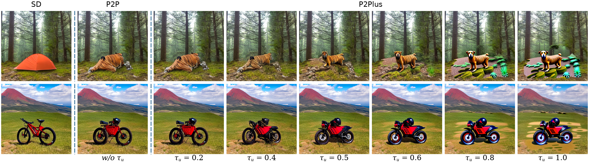
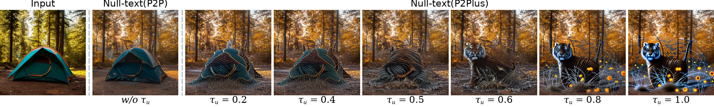
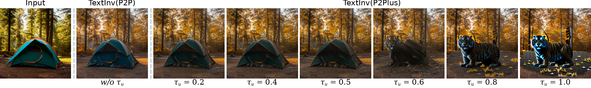

# P2Plus Jittor Reproduction

This folder contains the Jittor reproduction of `StyleDiffusion/p2plus`. The commands below mirror the original `StyleDiffusion/p2plus/README.md` examples, but use the Jittor implementation and JDiffusion backend. Run the commands from the `StyleDiffusion` repository root.

The reproduced figures embedded in this README are generated by the Jittor code with the full `tau_u` sweep from the original README and saved under `Jittor/p2plus/results`. The current workspace uses the locally available Stable Diffusion 1.5 weights (`--sd_version sd_1_5`). If Stable Diffusion 1.4 is available locally or can be downloaded, replace `--sd_version sd_1_5` with `--sd_version sd_1_4`.

## Editing generated image using P2Plus

```bash
python Jittor/p2plus/p2plus.py \
  --backend_module jdiffusion_backend \
  --sd_version sd_1_5 \
  --local_files_only True \
  --seed '[2720,]' \
  --prompt "a red mountain bike parked on top of a grass covered mountain hill" \
  --target "a red mountain motorcycle parked on top of a grass covered mountain hill" \
  --tau_c '[.8,]' \
  --tau_s '[.4,]' \
  --tau_u '[.0,.1,.2,.3,.4,.5,.6,.7,.8,.9,1.,]' \
  --blend_word "[('bike',), ('motorcycle',)]" \
  --eq_params "[('motorcycle',), (2,)]" \
  --edit_type Replacement \
  --outdir Jittor/run_outputs/p2plus_readme_tau_sweep/generated
```



P2Plus: we propose to further perform the self-attention map replacement in the unconditional branch based on P2P (called P2Plus), as well as in the conditional branch like P2P. P2P (the second column: w/o $\tau_u$) has not succeeded in replacing the tent with the tiger. Adding the injection parameter $\tau_u$ can help to edit successfully, especially if $\tau_u=0.5$. We also use the classifier-free guidance parameter $w=7.5$ like SD, when the weight $1-w$ of the unconditional branch is negative, which can gradually weaken the influence of the source object in the unconditional branch as $\tau_u$ increases from 0.2 to 1.0.

## Editing real image using Null-text with P2Plus

```bash
python Jittor/p2plus/null_text_w_p2plus.py \
  --backend_module jdiffusion_backend \
  --sd_version sd_1_5 \
  --local_files_only True \
  --num_ddim_steps 50 \
  --num_inner_steps 10 \
  --image_path './example_images/a tent in forest.jpg' \
  --prompt "a tent in forest" \
  --target "a tiger in forest" \
  --tau_c '[.6,]' \
  --tau_s '[.6,]' \
  --tau_u '[.0,.1,.2,.3,.4,.5,.6,.7,.8,.9,1.,]' \
  --blend_word "[('tent',), ('tiger',)]" \
  --eq_params "[('tiger',), (2,)]" \
  --edit_type Replacement \
  --outdir Jittor/run_outputs/p2plus_readme_tau_sweep/nulltext
```



## Editing real image using Text-embedding Inversion with P2Plus

```bash
python Jittor/p2plus/text_inv_w_p2plus.py \
  --backend_module jdiffusion_backend \
  --sd_version sd_1_5 \
  --local_files_only True \
  --num_ddim_steps 50 \
  --num_inner_steps 10 \
  --image_path './example_images/a tent in forest.jpg' \
  --prompt "a tent in forest" \
  --target "a tiger in forest" \
  --tau_c '[.6,]' \
  --tau_s '[.6,]' \
  --tau_u '[.0,.1,.2,.3,.4,.5,.6,.7,.8,.9,1.,]' \
  --blend_word "[('tent',), ('tiger',)]" \
  --eq_params "[('tiger',), (2,)]" \
  --edit_type Replacement \
  --outdir Jittor/run_outputs/p2plus_readme_tau_sweep/textinv
```




## Citation

```bibtex
@article{li2023stylediffusion,
  title={StyleDiffusion: Prompt-Embedding Inversion for Text-Based Editing},
  author={Li, Senmao and van de Weijer, Joost and Hu, Taihang and Khan, Fahad Shahbaz and Hou, Qibin and Wang, Yaxing and Yang, Jian},
  journal={arXiv preprint arXiv:2303.15649},
  year={2023}
}
```
