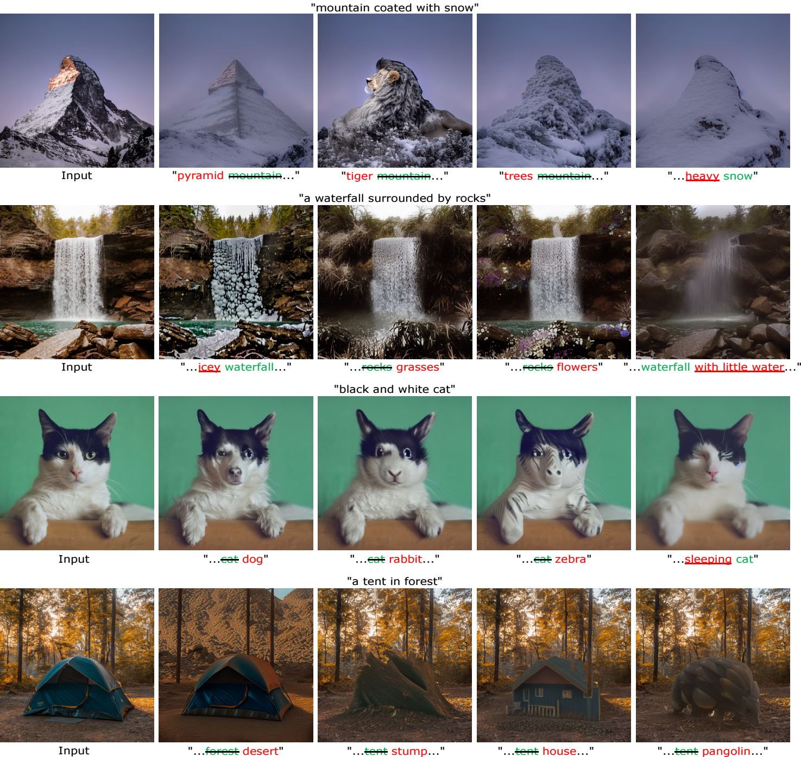

# StyleDiffusion: Prompt-Embedding Inversion for Text-Based Editing</sub>



**StyleDiffusion: Prompt-Embedding Inversion for Text-Based Editing**<br>

Abstract: *A significant research effort is focused on exploiting the amazing capacities of pretrained diffusion models for the editing of images. They either finetune the model, or invert the image in the latent space of the pretrained model. However, they suffer from two problems: (1) Unsatisfying results for selected regions, and unexpected changes in nonselected regions. (2) They require careful text prompt editing where the prompt should include all visual objects in the input image. To address this, we propose two improvements: (1) Only optimizing the input of the value linear network in the cross-attention layers, is sufficiently powerful to reconstruct a real image. (2) We propose attention regularization to preserve the object-like attention maps after editing, enabling us to obtain accurate style editing without invoking significant structural changes. We further improve the editing technique which is used for the unconditional branch of classifier-free guidance, as well as the conditional one as used by P2P. Extensive experimental prompt-editing results on a variety of images, demonstrate qualitatively and quantitatively that our method has superior editing capabilities than existing and concurrent works.*

[[`arXiv`](https://arxiv.org/abs/2303.15649)] [[`pdf`](https://arxiv.org/pdf/2303.15649.pdf)]

## Requirements
The codebase is tested on 
* Python 3.8
* PyTorch 1.12.1
* Quadro RTX 3090 GPUs (24 GB VRAM) with CUDA version 11.7

environment or python libraries:

```
pip install -r requirements.txt
```


## Train
training mapping-network of StyleDiffusion.

```
python edit_w_ptp_v_clip.py --is_train True --idx 2 --num_inner_steps 20
```

## Edite real image

edite real image using trained model.
```
python edit_w_ptp_v_clip.py --is_train False --idx 2 --num_inner_steps 20 \
                             --edit_type Replacement
```

There are four parameters controlling of the attention injection:
```
tau_v: trainer.v_replace_steps
tau_c: cross_replace_steps
tau_s: self_replace_steps
tau_u: uncond_self_replace_steps
```
It is commonly recommended to utilize the parameter values of tau_v=.5, tau_c=.6, tau_s=.6 and tau_u=.0. However, in situations where the target structure undergoes significant variations before and after editing, 
adjusting the parameters to tau_v=.5, tau_c=.6, tau_s=.6 and tau_u=.5 or tau_v=.2, tau_c=.6, tau_s=.6 and tau_u=.5 optimizes performance.

## Citation

```bibtex
@misc{li2023stylediffusion,
      title={StyleDiffusion: Prompt-Embedding Inversion for Text-Based Editing}, 
      author={Senmao Li and Joost van de Weijer and Taihang Hu and Fahad Shahbaz Khan and Qibin Hou and Yaxing Wang and Jian Yang},
      year={2023},
      eprint={2303.15649},
      archivePrefix={arXiv},
      primaryClass={cs.CV}
}
```


