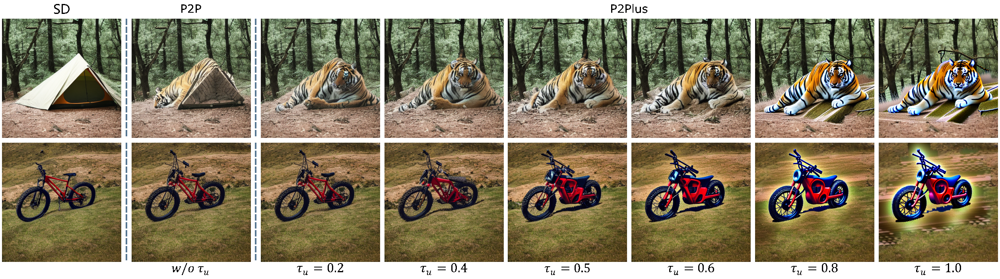
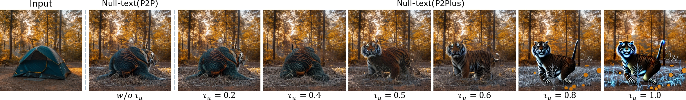
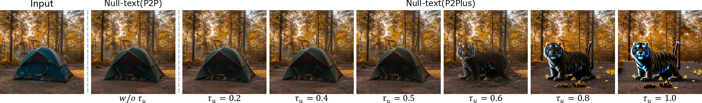

## Editing generated image using P2Plus
```
python p2plus.py --seed '[2720,]' --prompt "a red mountain bike parked on top of a grass covered mountain hill" \ 
                 --target "a red mountain motorcycle parked on top of a grass covered mountain hill" \
                 --tau_c "[.8,]"  --tau_s "[.4,]"  --tau_u "[.0,.1,.2,.3,.4,.5,.6,.7,.8,.9,1.,]" \
                 --blend_word "[('bike',), ('motorcycle',)]"  --eq_params "[('motorcycle',), (2,)]" \
                 --edit_type Replacement
```



*P2Plus: we propose to further perform the self-attention map replacement in  the unconditional branch based on P2P (called P2Plus), as well as in the conditional branch like P2P. P2P (the second column: w/o $\tau_u$) has not succeeded in replacing the tent with the tiger. Adding the injection parameter $\tau_u$ can help to edit successfully, especially if $\tau_u=0.5$. We also use the classifier-free guidance parameter $w=7.5$ like SD, when the weight $1-w$ of the unconditional branch is negative, which can gradually weaken the influence of the "tent" in the unconditional branch as $\tau_u$ increases from 0.2 to 1.0 (third to eighth columns).*


## Editing real image using Null-text with P2Plus
```
python null_text_w_p2plus.py --image_path "./example_images/a tent in forest.jpg" \
                             --prompt "a tent in forest" --target "a tiger in forest" \
                             --tau_c "[.6,]"  --tau_s "[.6,]"  --tau_u "[.0,.1,.2,.3,.4,.5,.6,.7,.8,.9,1.,]" \
                             --blend_word "[('tent',), ('tiger',)]"  --eq_params "[('tiger',), (2,)]" \
                             --edit_type Replacement
```



## Editing real image using Text-embedding Inversion with P2Plus
```
python text_inv_w_p2plus.py --image_path "./example_images/a tent in forest.jpg" \
                            --prompt "a tent in forest" --target "a tiger in forest" \
                            --tau_c "[.6,]"  --tau_s "[.6,]"  --tau_u "[.0,.1,.2,.3,.4,.5,.6,.7,.8,.9,1.,]" \
                            --blend_word "[('tent',), ('tiger',)]"  --eq_params "[('tiger',), (2,)]" \
                            --edit_type Replacement
```



## Citation

```bibtex
@misc{li2023stylediffusion,
      title={StyleDiffusion: Prompt-Embedding Inversion for Text-Based Editing}, 
      author={Senmao Li and Joost van de Weijer and Taihang Hu and Fahad Shahbaz Khan and Qibin Hou and Yaxing Wang and Jian Yang},
      year={2023},
      eprint={2303.15649},
      archivePrefix={arXiv},
      primaryClass={cs.CV}
}
```


